# 為什麼工程師都愛用 Markdown 寫文件？

**嗨，大家！你是否曾經遇過這些問題？**

1. **排版地獄**：在 Word 裡調整圖片位置，結果整份文件的文字都跑掉了。
2. **格式不相容**：把文件內容複製到 Email 或 LINE，格式瞬間亂成一團。
3. **專注力分散**：寫報告時，花在「調整字體大小、行距」的時間，比「寫內容」的時間還多。

如果你有同感，那麼你一定要認識這個提升效率的神器  **Markdown**。


# 什麼是 Markdown？

Markdown 不是程式語言，它是一種 **「輕量級的標記語法」**。 簡單來說，你只需要用鍵盤打出幾個簡單的符號（如 `#` 或 `-`），就能自動產生排版好的文件。

**它的核心理念是：雙手不離鍵盤，專注於「寫作內容」，而非「滑鼠排版」。**

目前我們的 **版控系統**、github、Slack、Notion、甚至 ChatGPT，全都支援這種語法！


# 只要記住這 5 招就能上手

不用死記硬背，Markdown 的邏輯非常直覺：

## 1. 標題 (Headings)

想設標題？在文字前面加 `#` 就好。

- `# 大標題` (對應 Word 的標題 1)
- `## 中標題` (對應 Word 的標題 2)
- `### 小標題`

## 2. 列表 (Lists)

想列清單？用減號 `-` 或數字 `1.` 開頭。

````markdown
- 項目 A
1. 第一點
````

- 項目 A
1. 第一點

## 3. 強調 (Emphasis)

想畫重點？用星號包起來。

````markdown
**這是粗體**
*這是斜體*
````

**這是粗體**
*這是斜體*


## 4. 待辦事項 (Checklist) 

在開會記錄或任務分配時超好用！

````markdown
- [ ] 尚未完成的工作
- [x] 已完成的工作
````

- [ ] 尚未完成的工作
- [x] 已完成的工作
- [ ] 

## 5. 程式碼區塊

如果文字中有英文指令或不想被翻譯的內容，用反引號包起來。

````markdown
請輸入 `login` 指令
````

請輸入 `login` 指令


# 有沒有好用的編輯器呢？

Markdown 其實用「記事本」就能寫，但搭配好用的工具，體驗會更上一層樓！

裡推薦兩款我常用的編輯器：


## 1. 給追求寫作體驗的人：[Typora](https://typora.io/)

**適合對象：PM、技術文件撰寫者**

**下載連結**：[Typora 所有版本下載)](https://typora.io/releases/all)


Typora 最大的特色是 **「所見即所得」(Live Preview)**。 當你打出 `**粗體**` 後，它會立刻變成 **粗體**，原本的標記符號會自動隱藏。畫面極度乾淨，讓你感覺像在寫 Word，但又享有 Markdown 的快速排版優勢。

**💡 版本說明**： 官方的 Stable Releases 目前需要付費購買，**但頁面中的 Dev / Beta Release (測試版) 則可免費下載使用。**

- **優點**：介面優雅、支援匯出 PDF/Word、即時渲染（打完馬上變漂亮的格式）。
- **推薦理由**：如果你想要「沉浸式寫作」，不想看到一堆符號，這是首選。


## 2. 給習慣多工與開發的人：[VS Code](https://code.visualstudio.com/download)

**適合對象**：工程師、程式工作者


這是目前許多工程師愛用的編輯器。透過安裝 Markdown 插件，它能變成強大的文件管理中心。

- **優點**：
  - **雙欄模式**：左邊寫原始碼，右邊即時預覽 (Preview)，適合需要精確控制格式的人。
  - **專案管理**：可以一次管理整個資料夾的文件。
  - **Git 整合**：寫完文件可以直接上傳到 Gitea。
- **推薦理由**：如果你原本就有寫程式的需求，或者需要同時管理多份文件，VS Code 會是最高效的選擇。


# 進階篇：讓你的文件變更有料

## 1. 程式碼區塊

Markdown 的程式碼區塊支援「語法高亮 (Syntax Highlighting)」，只要在**三個反引號**後面加上**語言名稱**，顏色就會自動跑出來，閱讀體驗瞬間提升！

**終端機指令 (Bash / Shell)**

```bash
# 1. 先切換到專案目錄
cd /home/user/project

# 2. 執行安裝指令
npm install

# 3. 啟動服務
npm start
```

**顯示設定檔 (JSON / YAML)**

```json
{
  "name": "專案 A",
  "version": "1.0.0",
  "status": "active",
  "owners": ["小明", "小華"]
}
```

**資料庫查詢語法 (SQL)**

```sql
SELECT * FROM users 
WHERE created_at > '2023-01-01' 
ORDER BY id DESC;
```

**呈現「修改前後」 (Diff)**

這是 **Release Note** 或 **交接文件** 的神器！ 使用 `diff` 語言，行首加 `-` 會變紅色（代表移除），加 `+` 會變綠色（代表新增）

```diff
  # 修改資料庫連線設定
  [database]
- host = 192.168.1.1
+ host = 192.168.50.100  <-- 改成這台新的伺服器
  port = 3306
```


## 2. 插入圖片

Markdown 的圖片語法跟「連結」非常像，差別只在最前面多了一個驚嘆號 `!`。

**語法結構：** ``

- **圖片說明 (Alt Text)**：當圖片跑不出來時顯示的文字，也可以留空。
- **圖片路徑**：可以是網路網址，或是電腦裡的檔案路徑。

**範例：**

```Markdown


```

>  **💡 小撇步**： 
>
> 在 **Typora**，或是有安裝外掛的 **VS Code**，通常直接 **「複製貼上」** (也就是直接 `Ctrl + V`) 圖片，編輯器就會自動幫你產生這段語法囉！


## 3. 建立表格 (Tables)

Markdown 畫表格其實就像在畫圖一樣直覺。 只需要用直線 `|` 來隔開欄位，並在第二行用減號 `-` 來分隔標題即可。

**語法結構：**

```Markdown
| 標題 A | 標題 B | 標題 C |
| :--- | :--- | :--- |
| 內容 1 | 內容 2 | 內容 3 |
| 內容 4 | 內容 5 | 內容 6 |
```

| 標題 A | 標題 B | 標題 C |
| :----- | :----- | :----- |
| 內容 1 | 內容 2 | 內容 3 |
| 內容 4 | 內容 5 | 內容 6 |

> **💡 小撇步**： 
>
> 覺得手打表格很累？其實 **不用自己打！** 只要從 **Excel** 或 **Google 試算表** 複製表格，直接在編輯器裡面 **「貼上」**，它就會自動幫你轉成 Markdown 語法了！

> Typora 本身也有支援表格的生成與編輯
> 


## 4. 畫圖不求人：Mermaid 圖表

這是工程師與 PM 最愛的功能！不用開繪圖軟體，直接用文字就能畫出流程圖、甘特圖。

**範例 狀態圖**

```mermaid
stateDiagram-v2
    %% [*] 代表起始和結束點
    [*] --> 待處理(Open)

    待處理(Open) --> 進行中(In Progress) : 開始認領任務
    
    進行中(In Progress) --> 已解決(Resolved) : 完成開發與測試
    
    已解決(Resolved) --> 已關閉(Closed) : 確認無誤
    
    已解決(Resolved) --> 進行中(In Progress) : 測試失敗(Reopen)
    
    已關閉(Closed) --> [*]
```



````markdown

````


**範例 時序圖**

```mermaid
sequenceDiagram
    User->>System: 1. 送出登入請求
    System->>DB: 2. 驗證帳號密碼
    DB-->>System: 3. 回傳使用者資料
    System-->>User: 4. 登入成功 (Token)
```



````markdown

````

**範例 流程圖**

```mermaid
graph TD
    Start((開始申請)) --> Submit[提交表單]
    Submit --> Manager{主管審核?}
    
    %% 審核通過的路徑
    Manager -- 同意 --> Finance{財務複審?}
    Finance -- 同意 --> Done((流程結束))
    
    %% 審核被拒的路徑
    Manager -- 退回 --> Reject[修正後重新提交]
    Finance -- 退回 --> Reject
    Reject -.-> Submit

    %% 定義樣式類別
    classDef success fill:#d4edda,stroke:#28a745,color:#155724;
    classDef reject fill:#f8d7da,stroke:#dc3545,color:#721c24;
    classDef process fill:#cce5ff,stroke:#004085,color:#004085;

    %% 套用樣式到節點
    class Done,Finance success;
    class Reject reject;
    class Submit,Manager process;
```



````markdown

````

